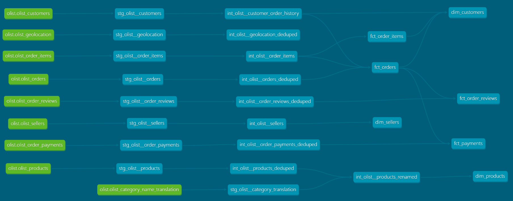
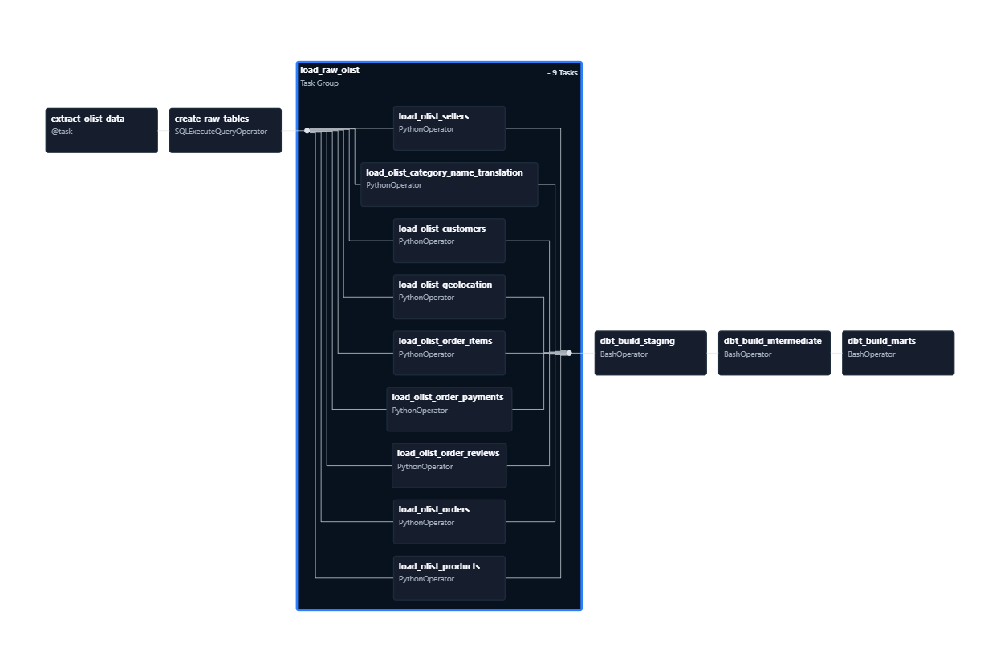

# **🌀 Olist Data Pipeline Documentation Overview**

This project implements an end-to-end ELT (Extract, Load, Transform) pipeline orchestrated by Apache Airflow. The core design follows the Medallion Architecture, providing a logical framework for data quality and refinement as it moves from raw ingestion to business-ready insights.

### 🐳 Infrastructure & Containerization
To manage the complexity of multiple services, I utilized Docker Compose to orchestrate the following:

- **Service Isolation**: Each component (Airflow Webserver/Scheduler, PostgreSQL, and dbt) runs in its own isolated container.

- **Custom Network Topology**: A dedicated Docker bridge network allows for secure inter-container communication. For example, the Airflow worker connects to the Postgres instance using the internal service name as the hostname.

- **Volume Persistence**: Implemented Docker volumes for the Postgres data directory to ensure data persistence across container restarts and for Airflow DAG mapping.

### 🏗️ Architecture & Component Stack
- **Orchestration**: Apache Airflow manages the end-to-end workflow, handling task dependencies, retries, and scheduling.

- **Ingestion (Python)**: A custom Python ingestion script utilizes the Kaggle API for data extraction. Following software engineering best practices, the extractor is built with modularity and type-safety in mind to ensure robust data retrieval.

- **Storage (PostgreSQL)**: PostgreSQL serves as the primary data warehouse. To circumvent Postgres's cross-database limitations, a multi-schema strategy was implemented to isolate the architectural layers (Bronze, Silver, Gold).

- **Transformation (dbt)**: Data Build Tool (dbt) manages the T (Transform) in ELT. It handles data modeling, version control of SQL logic, and the materialization of views and tables across the defined schemas.

### 🧬 The Medallion Implementation
Because PostgreSQL operates within a single database instance for this use case, I mimicked the Medallion layers through logical schema separation:

1. **Bronze (Raw):** Landing zone for immutable, raw data ingested via Python.

2. **Silver (Cleansed):** Data is deduplicated, cast to correct types, and filtered using dbt models.

3. **Gold (Curated):** Business-level aggregates and final dimensions/facts ready for analytics.
   
## **Dataset**

This dataset was generously provided by Olist, the largest department store in Brazilian marketplaces. The dataset has information of 100k orders from 2016 to 2018 made at multiple marketplaces in Brazil. 
For more information, this dataset was pulled from Kaggle API. Here is the direct [Kaggle Link](https://www.kaggle.com/datasets/olistbr/brazilian-ecommerce?resource=download).

> **Note:** There are multiple versions of this dataset uploaded by the author. The data within this project uses the third version of the Dataset. The raw CSV files can be found at the link above or within the ``` data/ ``` folder:

### Raw Data Schema
The data is divided in multiple datasets for better understanding and organization. Please refer to the following data schema when working with it. 


### Table Information
The data found here can be also found in [Kaggle](https://www.kaggle.com/datasets/olistbr/brazilian-ecommerce?resource=download). However, if you know dbt, you may check the dbt documentation generated by ```dbt docs generate ```.
| Dataset          |  Information                                                                                      |     |
| --------------- | -------------------------------------------------------------------------------------------------------------------------------------------------------------------- | --- |
| orders          | core dataset. From each order you might find all other information. 
| order_items     | includes data about the items purchased within each order.                                                                                                           |     |
| order_reviews   | Includes data about the reviews made by the customers.                                                                                                               |     |
| order_payments  | Includes data about the orders payment options.                                                                                                                      |     |
| order_customers | Information about the customer and its location. Use it to identify unique customers in the orders dataset and to find the orders delivery location.                 |     |
| products        | includes data about the products sold by Olist.                                                                                                                      |     |
| sellers         | dataset includes data about the sellers that fulfilled orders made at Olist. Use it to find the seller location and to identify which seller fulfilled each product. |     |
| geolocation     | Information Brazilian zip codes and its lat/lng coordinates. Use it to plot maps and find distances between sellers and customers.                                   |     |
|                 |                                                                                                                                                                      |     |

### Granularity of the data
You may have noticed the schema showed above and its similar to a star schema. However, the schema above only shows the relationships of the tables and we should not rely on the raw schema as our final schema. I followed the since it does not meet specific requirements needed to be called a traditional star schema due to its granularity.

- `olist_orders_dataset`: One unique order per customer. By real-world definition, a customer can have zero-to-many orders. But in this table, a customer can have **one-to-many orders**. 
- `olist_order_customers_dataset`: One row is a customer's unique order. Meaning if a customer with a customer_id `0001` has five orders, that means that the customer_id `0001` will have five records.
- `olist_order_reviews`: One order represented by an `order_id` can have one or more order reviews, represented by `order_review_id`. However, that goes the same for order reviews. One `order_reivew_id` can be represented by one or more orders `order_id`. 
- `order_payments`: For every row in `order_payments`, represents one **payment sequential** for a single order. A single order can be paid with one or more payments. 
- `order_geolocation`: It's granularity depends on a city/states `latitude` and `longitude` values.  

Given the information above, data modelling the final core schema for analytics will entirely depend on business needs. However in this case, I made sure to clean the granularity of data to ensure high granularity. T the grain of the fact tables matches with the dimension tables.

### dbt Lineage

### Airflow DAG Run

**Oveview:**
- `extract_olist_data`: Extracts the raw CSV files from Kaggle API and loads it into a staging folder.
  
- `create_raw_tables`: SQL DDL script that creates the raw tables in the data warehouse.
  
- `load_raw_olist`: A PythonOperator task group consisting of loading each dataset into the raw landing tables created by `create_raw_tables` using `COPY INTO` statements.
  
- `dbt_build_staging`: Airflow running a bash operator running `dbt build --models staging` in the `dbt` container.
  
- `dbt_build_intermediate`: Airflow running a bash operator running `dbt build --models int` in the `dbt` container.
  
- `dbt_build_marts`: Airflow running a bash operator running `dbt build --models marts` in the `dbt` container.
